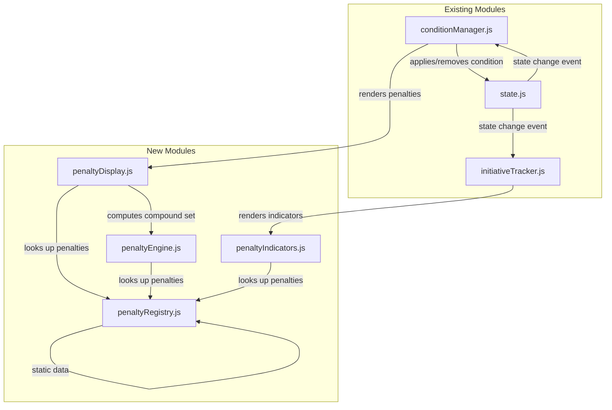

# Design Document: Auto Condition Penalties

## Overview

This feature extends the existing Condition Manager module to automatically display and summarize the mechanical penalties associated with D&D 5e conditions. Currently, the DM can add/remove conditions but must manually recall their effects. This design introduces a client-side Penalty Registry (a static data module), a Penalty Display renderer, a Compound Penalty computation engine, and penalty indicator enhancements to the Initiative Tracker.

All new logic is pure client-side JavaScript. No backend changes are required — the penalty data is static SRD reference data embedded in the application. The existing condition add/remove API and state management remain unchanged; this feature layers penalty lookup and display on top of the current condition lifecycle.

## Architecture

The feature follows the existing modular vanilla JS architecture. Four new modules are introduced, each with a single responsibility:



**Data flow on condition apply:**
1. DM clicks "Apply Condition" → `conditionManager.applyCondition()` updates state via API
2. State change triggers re-render of `conditionManager.render()` and `initiativeTracker.render()`
3. `conditionManager.render()` calls `penaltyDisplay` to render individual penalties and compound summary
4. `penaltyDisplay` calls `penaltyRegistry` for lookups and `penaltyEngine` for compound computation
5. `initiativeTracker.render()` calls `penaltyIndicators` to render compact icons with tooltips

## Components and Interfaces

### 1. penaltyRegistry.js — Static Penalty Data

A pure data module exporting lookup functions over a frozen penalty dataset.

```js
// Penalty object shape
/**
 * @typedef {Object} Penalty
 * @property {string} type - One of the penalty type constants
 * @property {string} mechanic - The affected game mechanic
 * @property {string} description - Human-readable description
 */

// Penalty type constants
const PENALTY_TYPES = Object.freeze({
  DISADVANTAGE_ON_ATTACK: 'disadvantage_on_attack',
  ADVANTAGE_AGAINST: 'advantage_against',
  AUTO_FAIL_SAVE: 'auto_fail_save',
  AUTO_FAIL_CHECK: 'auto_fail_check',
  SPEED_ZERO: 'speed_zero',
  INCAPACITATED: 'incapacitated',
  CANNOT_TAKE_ACTIONS: 'cannot_take_actions',
  CANNOT_TAKE_REACTIONS: 'cannot_take_reactions',
  CANNOT_SPEAK: 'cannot_speak',
  ADVANTAGE_ON_ATTACK: 'advantage_on_attack',
  DISADVANTAGE_AGAINST: 'disadvantage_against',
  DESCRIPTIVE_NOTE: 'descriptive_note',
});

// Public API
function getPenalties(conditionName): Penalty[]
function getAllConditions(): string[]
function getPenaltyTypes(): object
function getImpliedConditions(conditionName): string[]
```

The registry stores the 14 SRD conditions and their penalties as a frozen `Map<string, Penalty[]>`. It also stores implied-condition relationships (e.g., stunned → incapacitated, unconscious → incapacitated).

### 2. penaltyEngine.js — Compound Penalty Computation

A pure function module that merges penalties from multiple conditions into a deduplicated, categorized summary.

```js
// Compound penalty entry
/**
 * @typedef {Object} CompoundPenalty
 * @property {string} type - Penalty type constant
 * @property {string} mechanic - Affected mechanic
 * @property {string} description - Human-readable text
 * @property {string[]} sources - Condition names contributing this penalty
 */

// Penalty category constants
const PENALTY_CATEGORIES = Object.freeze({
  ATTACK_MODIFIERS: 'attack_modifiers',
  DEFENSE_MODIFIERS: 'defense_modifiers',
  SAVING_THROW_EFFECTS: 'saving_throw_effects',
  MOVEMENT_EFFECTS: 'movement_effects',
  ACTION_RESTRICTIONS: 'action_restrictions',
});

// Public API
function computeCompoundPenalties(conditionNames: string[]): CompoundPenalty[]
function groupByCategory(compoundPenalties: CompoundPenalty[]): Map<string, CompoundPenalty[]>
function getImpliedConditionNotes(conditionNames: string[]): ImpliedNote[]
```

Key behaviors:
- Deduplication: when multiple conditions produce the same `(type, mechanic)` pair, the result contains one entry with all source conditions listed.
- Categorization: each penalty type maps to exactly one category.
- Implied conditions: returns notes (not active conditions) for implied relationships.

### 3. penaltyDisplay.js — Penalty Rendering

A rendering module that produces HTML strings for penalty information within the Condition Manager panel.

```js
// Public API
function renderPenaltiesForCondition(conditionName: string): string
function renderCompoundSummary(conditionNames: string[]): string
function renderImpliedNotes(conditionNames: string[]): string
function renderNoPenaltiesMessage(): string
```

This module is consumed by `conditionManager.render()` to inject penalty HTML into the existing condition list UI.

### 4. penaltyIndicators.js — Initiative Tracker Indicators

A rendering module that produces compact penalty icon HTML and tooltip content for the initiative tracker.

```js
// Public API
function renderPenaltyIcons(conditionNames: string[]): string
function renderPenaltyTooltip(conditionName: string): string
```

This module is consumed by `initiativeTracker.render()` to add penalty icons next to combatant names.

### 5. Modifications to Existing Modules

**conditionManager.js:**
- Import `penaltyDisplay`
- In `render()`, call `renderPenaltiesForCondition()` beneath each active condition name
- In `render()`, call `renderCompoundSummary()` above the individual condition list when conditions are active
- In `render()`, call `renderImpliedNotes()` to show implied condition notes
- When no conditions are active, call `renderNoPenaltiesMessage()`

**initiativeTracker.js:**
- Import `penaltyIndicators`
- In `render()`, call `renderPenaltyIcons()` next to combatant names
- In `getConditionIndicators()`, add tooltip content via `renderPenaltyTooltip()`

## Data Models

### Penalty Registry Data Structure

```js
// Internal frozen map: condition name → penalty array
const CONDITION_PENALTIES = Object.freeze({
  blinded: Object.freeze([
    { type: 'disadvantage_on_attack', mechanic: 'attack_rolls', description: 'Disadvantage on attack rolls' },
    { type: 'advantage_against', mechanic: 'attack_rolls', description: 'Attack rolls against have advantage' },
  ]),
  charmed: Object.freeze([
    { type: 'descriptive_note', mechanic: 'attack', description: 'Cannot attack the charmer' },
    { type: 'advantage_against', mechanic: 'social_checks', description: 'Charmer has advantage on social ability checks' },
  ]),
  deafened: Object.freeze([
    { type: 'auto_fail_check', mechanic: 'hearing_checks', description: 'Auto-fails ability checks requiring hearing' },
  ]),
  frightened: Object.freeze([
    { type: 'disadvantage_on_attack', mechanic: 'attack_rolls', description: 'Disadvantage on attack rolls while source in sight' },
    { type: 'auto_fail_check', mechanic: 'ability_checks', description: 'Disadvantage on ability checks while source in sight' },
  ]),
  grappled: Object.freeze([
    { type: 'speed_zero', mechanic: 'movement', description: 'Speed becomes 0' },
  ]),
  incapacitated: Object.freeze([
    { type: 'cannot_take_actions', mechanic: 'actions', description: 'Cannot take actions' },
    { type: 'cannot_take_reactions', mechanic: 'reactions', description: 'Cannot take reactions' },
  ]),
  invisible: Object.freeze([
    { type: 'advantage_on_attack', mechanic: 'attack_rolls', description: 'Advantage on attack rolls' },
    { type: 'disadvantage_against', mechanic: 'attack_rolls', description: 'Attack rolls against have disadvantage' },
  ]),
  paralyzed: Object.freeze([
    { type: 'incapacitated', mechanic: 'actions', description: 'Incapacitated' },
    { type: 'speed_zero', mechanic: 'movement', description: 'Cannot move' },
    { type: 'cannot_speak', mechanic: 'speech', description: 'Cannot speak' },
    { type: 'auto_fail_save', mechanic: 'strength_saves', description: 'Auto-fails Strength saving throws' },
    { type: 'auto_fail_save', mechanic: 'dexterity_saves', description: 'Auto-fails Dexterity saving throws' },
    { type: 'advantage_against', mechanic: 'attack_rolls', description: 'Attack rolls against have advantage' },
    { type: 'descriptive_note', mechanic: 'critical_hits', description: 'Hits from within 5 feet are critical hits' },
  ]),
  petrified: Object.freeze([
    { type: 'descriptive_note', mechanic: 'weight', description: 'Weight increases by factor of ten' },
    { type: 'incapacitated', mechanic: 'actions', description: 'Incapacitated' },
    { type: 'speed_zero', mechanic: 'movement', description: 'Cannot move' },
    { type: 'cannot_speak', mechanic: 'speech', description: 'Cannot speak' },
    { type: 'descriptive_note', mechanic: 'awareness', description: 'Unaware of surroundings' },
    { type: 'advantage_against', mechanic: 'attack_rolls', description: 'Attack rolls against have advantage' },
    { type: 'auto_fail_save', mechanic: 'strength_saves', description: 'Auto-fails Strength saving throws' },
    { type: 'auto_fail_save', mechanic: 'dexterity_saves', description: 'Auto-fails Dexterity saving throws' },
    { type: 'descriptive_note', mechanic: 'damage_resistance', description: 'Resistance to all damage' },
  ]),
  poisoned: Object.freeze([
    { type: 'disadvantage_on_attack', mechanic: 'attack_rolls', description: 'Disadvantage on attack rolls' },
    { type: 'auto_fail_check', mechanic: 'ability_checks', description: 'Disadvantage on ability checks' },
  ]),
  prone: Object.freeze([
    { type: 'disadvantage_on_attack', mechanic: 'attack_rolls', description: 'Disadvantage on attack rolls' },
    { type: 'advantage_against', mechanic: 'melee_attacks', description: 'Melee attacks against have advantage' },
    { type: 'disadvantage_against', mechanic: 'ranged_attacks', description: 'Ranged attacks from >5ft against have disadvantage' },
  ]),
  restrained: Object.freeze([
    { type: 'speed_zero', mechanic: 'movement', description: 'Speed becomes 0' },
    { type: 'disadvantage_on_attack', mechanic: 'attack_rolls', description: 'Disadvantage on attack rolls' },
    { type: 'advantage_against', mechanic: 'attack_rolls', description: 'Attack rolls against have advantage' },
    { type: 'auto_fail_save', mechanic: 'dexterity_saves', description: 'Disadvantage on Dexterity saving throws' },
  ]),
  stunned: Object.freeze([
    { type: 'incapacitated', mechanic: 'actions', description: 'Incapacitated' },
    { type: 'speed_zero', mechanic: 'movement', description: 'Cannot move' },
    { type: 'auto_fail_save', mechanic: 'strength_saves', description: 'Auto-fails Strength saving throws' },
    { type: 'auto_fail_save', mechanic: 'dexterity_saves', description: 'Auto-fails Dexterity saving throws' },
    { type: 'advantage_against', mechanic: 'attack_rolls', description: 'Attack rolls against have advantage' },
  ]),
  unconscious: Object.freeze([
    { type: 'incapacitated', mechanic: 'actions', description: 'Incapacitated' },
    { type: 'speed_zero', mechanic: 'movement', description: 'Cannot move' },
    { type: 'cannot_speak', mechanic: 'speech', description: 'Cannot speak' },
    { type: 'descriptive_note', mechanic: 'items', description: 'Drops held items' },
    { type: 'descriptive_note', mechanic: 'prone', description: 'Falls prone' },
    { type: 'auto_fail_save', mechanic: 'strength_saves', description: 'Auto-fails Strength saving throws' },
    { type: 'auto_fail_save', mechanic: 'dexterity_saves', description: 'Auto-fails Dexterity saving throws' },
    { type: 'advantage_against', mechanic: 'attack_rolls', description: 'Attack rolls against have advantage' },
    { type: 'descriptive_note', mechanic: 'critical_hits', description: 'Hits from within 5 feet are critical hits' },
  ]),
});

// Implied condition relationships
const IMPLIED_CONDITIONS = Object.freeze({
  stunned: ['incapacitated'],
  paralyzed: ['incapacitated'],
  petrified: ['incapacitated'],
  unconscious: ['incapacitated'],
});
```

### Compound Penalty Output Shape

```js
{
  penalties: [
    {
      type: 'disadvantage_on_attack',
      mechanic: 'attack_rolls',
      description: 'Disadvantage on attack rolls',
      sources: ['blinded', 'poisoned']
    }
  ],
  byCategory: {
    attack_modifiers: [...],
    defense_modifiers: [...],
    saving_throw_effects: [...],
    movement_effects: [...],
    action_restrictions: [...]
  },
  impliedNotes: [
    { parentCondition: 'stunned', impliedCondition: 'incapacitated', description: 'Stunned includes incapacitated' }
  ]
}
```

### Category Mapping

| Penalty Type | Category |
|---|---|
| `disadvantage_on_attack` | attack_modifiers |
| `advantage_on_attack` | attack_modifiers |
| `advantage_against` | defense_modifiers |
| `disadvantage_against` | defense_modifiers |
| `auto_fail_save` | saving_throw_effects |
| `auto_fail_check` | saving_throw_effects |
| `speed_zero` | movement_effects |
| `incapacitated` | action_restrictions |
| `cannot_take_actions` | action_restrictions |
| `cannot_take_reactions` | action_restrictions |
| `cannot_speak` | action_restrictions |
| `descriptive_note` | (categorized by mechanic context) |


## Correctness Properties

*A property is a characteristic or behavior that should hold true across all valid executions of a system — essentially, a formal statement about what the system should do. Properties serve as the bridge between human-readable specifications and machine-verifiable correctness guarantees.*

### Property 1: Registry completeness

*For any* condition name in the set of 14 standard D&D 5e conditions (blinded, charmed, deafened, frightened, grappled, incapacitated, invisible, paralyzed, petrified, poisoned, prone, restrained, stunned, unconscious), `getPenalties(condition)` SHALL return a non-empty array of penalty objects.

**Validates: Requirements 1.1**

### Property 2: Penalty structure validity

*For any* condition in the registry and *for any* penalty object in that condition's penalty list, the penalty SHALL have a `type` field whose value is one of the 12 allowed penalty types, a `mechanic` field that is a non-empty string, and a `description` field that is a non-empty string.

**Validates: Requirements 1.2, 1.3**

### Property 3: Penalty data round-trip

*For any* condition in the registry, serializing its penalty list to JSON and deserializing it back SHALL produce a data structure that is deep-equal to the original penalty list.

**Validates: Requirements 1.4**

### Property 4: Rendered penalty completeness

*For any* condition name in the registry, the output of `renderPenaltiesForCondition(conditionName)` SHALL contain the description text of every penalty defined for that condition in the registry.

**Validates: Requirements 2.2**

### Property 5: Compound penalty correctness

*For any* non-empty subset of the 14 D&D 5e conditions, `computeCompoundPenalties(conditionNames)` SHALL return exactly one entry per unique `(type, mechanic)` pair found across all input conditions, and each entry's `sources` array SHALL contain every condition name that contributes that `(type, mechanic)` pair.

**Validates: Requirements 3.1, 3.2**

### Property 6: Category assignment completeness

*For any* non-empty subset of conditions, every penalty in the output of `computeCompoundPenalties` SHALL be assigned to exactly one of the five categories (attack_modifiers, defense_modifiers, saving_throw_effects, movement_effects, action_restrictions) by `groupByCategory`, and no penalty SHALL be omitted.

**Validates: Requirements 3.5**

### Property 7: Tooltip content completeness

*For any* condition name in the registry, the output of `renderPenaltyTooltip(conditionName)` SHALL contain the condition name and the description of every penalty defined for that condition.

**Validates: Requirements 4.2**

### Property 8: Implied condition notes produced

*For any* condition that has implied conditions (stunned, paralyzed, petrified, unconscious), `getImpliedConditionNotes([conditionName])` SHALL return at least one note identifying the implied condition and its relationship to the parent.

**Validates: Requirements 5.1**

### Property 9: Implied conditions are notes only

*For any* set of conditions passed to `computeCompoundPenalties`, the function SHALL NOT add any condition names to the output's `sources` arrays that were not present in the input set. Implied conditions appear only as notes, never as phantom source conditions.

**Validates: Requirements 5.3**

## Error Handling

| Scenario | Behavior |
|---|---|
| Unknown condition name passed to `getPenalties()` | Returns empty array, logs warning to console |
| `null` or `undefined` condition name | Returns empty array, no error thrown |
| Empty conditions array to `computeCompoundPenalties()` | Returns empty penalties object with empty categories |
| Combatant with no conditions in state | Penalty Display shows "No active penalties" message |
| Malformed condition object in state (missing `.condition` field) | Gracefully skipped during rendering, logged to console |
| Registry data integrity failure (frozen object tampered) | Object.freeze prevents mutation; any attempt silently fails in non-strict mode or throws in strict mode |

All error handling follows the existing application pattern: catch errors, log to console, and show user-friendly messages via the existing `showError()` pattern. No errors in the penalty system should crash the Condition Manager or Initiative Tracker — penalty display degrades gracefully to showing conditions without penalty details.

## Testing Strategy

### Unit Tests (Jest)

Example-based unit tests for specific scenarios and data accuracy:

- **Penalty Registry data accuracy**: One test per condition (14 tests) verifying exact penalty lists match SRD (Requirements 6.1–6.14)
- **Penalty Display rendering**: Verify HTML output structure for specific conditions
- **Compound summary with no conditions**: Verify empty state message
- **Condition removal clears penalties**: Verify penalties disappear from display
- **Implied condition notes appear/disappear**: Verify notes for stunned→incapacitated, etc.
- **Independent removal of parent/child conditions**: Verify each can be removed independently
- **Initiative tracker icons**: Verify icons appear with conditions and disappear without
- **Error cases**: Unknown conditions, null inputs, malformed data

### Property-Based Tests (fast-check)

Property-based tests using `fast-check` (already in devDependencies) with minimum 100 iterations each:

- **Property 1**: Registry completeness — generate random selections from the 14 condition names, verify non-empty results
- **Property 2**: Penalty structure validity — for generated condition names, verify all penalty objects have valid structure
- **Property 3**: Round-trip — for generated conditions, verify JSON serialization round-trip
- **Property 4**: Rendered penalty completeness — for generated conditions, verify render output contains all descriptions
- **Property 5**: Compound penalty correctness — for generated subsets of conditions, verify deduplication and source tracking
- **Property 6**: Category assignment — for generated condition subsets, verify all penalties categorized
- **Property 7**: Tooltip completeness — for generated conditions, verify tooltip contains all info
- **Property 8**: Implied condition notes — for generated conditions with implications, verify notes produced
- **Property 9**: Implied conditions are notes only — for generated condition subsets, verify no phantom sources

Each property test will be tagged with:
```
// Feature: auto-condition-penalties, Property N: [property text]
```

### Test File Organization

```
tests/
  penaltyRegistry.test.js      — Registry data accuracy (unit) + Properties 1, 2, 3
  penaltyEngine.test.js         — Compound computation (unit) + Properties 5, 6, 9
  penaltyDisplay.test.js        — Rendering tests (unit) + Properties 4, 7
  penaltyIndicators.test.js     — Initiative tracker indicators (unit)
  conditionInteractions.test.js — Implied conditions (unit) + Property 8
```
