# Design Document

## Overview

The Siege of Neverwinter application is a full-stack web application built with modern web technologies. The architecture follows a modular component-based design where each major feature (initiative tracker, character sheets, map, etc.) exists as an independent module that can be shown, hidden, and repositioned. The application uses PostgreSQL for persistent data storage and integrates with both the OpenAI ChatGPT API and the Anthropic Claude API for AI-powered DM assistance, allowing the DM to choose their preferred provider.

The technical stack consists of:
- **Frontend**: React with [Tremor](https://www.tremor.so/) UI component library, Tailwind CSS for styling, and Radix UI primitives (via Tremor)
- **Backend**: Node.js with Express for REST API server
- **Database**: PostgreSQL for persistent data storage
- **API Integration**: OpenAI ChatGPT API and Anthropic Claude API for AI assistant functionality (selectable by the DM)
- **Map Rendering**: SVG or Canvas-based interactive map with clickable regions (rendered within React components)

## Architecture

### High-Level Architecture

The application follows a client-server architecture with MVC pattern. The frontend is built as a React + Tremor component hierarchy where each module is wrapped in a Tremor `Card` container and uses Tremor's dashboard-optimized components internally.

```
┌─────────────────────────────────────────────────────────────────────┐
│                    React + Tremor UI Layer                           │
│                                                                     │
│  ┌─────────────────────────────────────────────────────────────┐   │
│  │  App Shell (Tailwind CSS Grid Layout)                        │   │
│  │  ┌─────────────────────────────────────────────────────┐    │   │
│  │  │  Layout Manager (CSS Grid: 2/3/4 cols)              │    │   │
│  │  │                                                     │    │   │
│  │  │  ┌─────────────┐  ┌─────────────┐  ┌───────────┐  │    │   │
│  │  │  │ Card:       │  │ Card:       │  │ Card:     │  │    │   │
│  │  │  │ Initiative  │  │ Character   │  │ Siege     │  │    │   │
│  │  │  │ (Table,     │  │ (TextInput, │  │ (BarChart,│  │    │   │
│  │  │  │  Badge)     │  │  Badge,     │  │  Tracker, │  │    │   │
│  │  │  │             │  │  Tracker)   │  │  Textarea)│  │    │   │
│  │  │  └─────────────┘  └─────────────┘  └───────────┘  │    │   │
│  │  │  ┌─────────────┐  ┌─────────────┐  ┌───────────┐  │    │   │
│  │  │  │ Card:       │  │ Card:       │  │ Card:     │  │    │   │
│  │  │  │ Monster DB  │  │ NPC Panel   │  │ AI Chat   │  │    │   │
│  │  │  │ (Table,     │  │ (TextInput, │  │ (TextInput│  │    │   │
│  │  │  │  Dialog,    │  │  Badge,     │  │  List)    │  │    │   │
│  │  │  │  List)      │  │  Tracker)   │  │           │  │    │   │
│  │  │  └─────────────┘  └─────────────┘  └───────────┘  │    │   │
│  │  │  ┌─────────────────────────────────────────────┐   │    │   │
│  │  │  │ Card: City Map (SVG + Tremor Legend/Badge)   │   │    │   │
│  │  │  └─────────────────────────────────────────────┘   │    │   │
│  │  └─────────────────────────────────────────────────────┘    │   │
│  └─────────────────────────────────────────────────────────────┘   │
└─────────────────────────────────────────────────────────────────────┘
                         │ HTTP/REST API
┌─────────────────────────────────────────────────────────────────────┐
│                  Backend API Layer (Node.js/Express)                 │
│  ┌──────────────┐  ┌──────────────┐  ┌──────────────┐             │
│  │   Combat     │  │   Character  │  │    Siege     │             │
│  │   Routes     │  │    Routes    │  │    Routes    │             │
│  └──────────────┘  └──────────────┘  └──────────────┘             │
│  ┌──────────────┐  ┌──────────────┐                               │
│  │     Map      │  │      AI      │                               │
│  │   Routes     │  │    Routes    │                               │
│  └──────────────┘  └──────────────┘                               │
└─────────────────────────────────────────────────────────────────────┘
                         │
┌─────────────────────────────────────────────────────────────────────┐
│                     Data Layer                                       │
│  ┌──────────────┐  ┌──────────────┐  ┌──────────────┐             │
│  │  PostgreSQL  │  │   ChatGPT    │  │   Claude     │             │
│  │   Database   │  │     API      │  │     API      │             │
│  └──────────────┘  └──────────────┘  └──────────────┘             │
│                    ┌──────────────┐                                 │
│                    │   Session    │                                 │
│                    │   Manager    │                                 │
│                    └──────────────┘                                 │
└─────────────────────────────────────────────────────────────────────┘
```

### Tremor Component Hierarchy

```mermaid
graph TD
    App[App Shell] --> LM[Layout Manager]
    LM --> IT[Initiative Tracker Card]
    LM --> CP[Character Panel Card]
    LM --> SM[Siege Mechanics Card]
    LM --> MD[Monster Database Card]
    LM --> NP[NPC Panel Card]
    LM --> AI[AI Assistant Card]
    LM --> CM[City Map Card]

    IT --> IT_Table[Table + TableHead + TableBody + TableRow]
    IT --> IT_Badge[Badge - combatant type indicators]
    IT --> IT_Button[Button - next turn, add/remove]

    CP --> CP_Input[NumberInput - HP, AC, saves]
    CP --> CP_Badge[Badge - conditions]
    CP --> CP_Tracker[Tracker - HP bar]
    CP --> CP_Divider[Divider - section separators]

    SM --> SM_BarChart[BarChart - resource levels]
    SM --> SM_Tracker[Tracker - wall/morale/supplies]
    SM --> SM_Textarea[Textarea - siege notes]
    SM --> SM_NumberInput[NumberInput - custom metrics]

    MD --> MD_Table[Table - monster list]
    MD --> MD_Dialog[Dialog - stat block detail view]
    MD --> MD_Button[Button - add to encounter]
    MD --> MD_SearchSelect[SearchSelect - filter monsters]

    NP --> NP_Input[TextInput/NumberInput - NPC stats]
    NP --> NP_Badge[Badge - conditions]
    NP --> NP_Tracker[Tracker - HP bar]

    AI --> AI_Input[TextInput - message input]
    AI --> AI_List[List - conversation history]
    AI --> AI_Button[Button - send message]
    AI --> AI_Callout[Callout - error/status messages]
    AI --> AI_Select[Select - provider selector ChatGPT/Claude]

    CM --> CM_SVG[SVG Map - interactive regions]
    CM --> CM_Legend[Legend - location status colors]
    CM --> CM_Badge[Badge - plot point markers]
```



### Module System

Each UI module is self-contained with:
- Independent rendering logic
- Event handlers for user interactions
- State management tied to the global application state
- Show/hide/resize capabilities
- Drag-and-drop repositioning within column layouts
- Expand/shrink functionality to span columns

### Layout System

The application supports flexible column-based layouts:
- **Column Configurations**: 2, 3, or 4 column layouts selectable by the DM
- **Module Placement**: Modules can be dragged and repositioned within the column grid
- **Module Expansion**: Modules can expand to span their entire column width
- **Layout Persistence**: Selected layout configuration and module positions persist across sessions

**Design Rationale**: A column-based grid system provides structure while allowing flexibility. This approach balances ease of implementation with customization needs, avoiding the complexity of free-form positioning while still giving DMs control over their workspace organization.

## Components and Interfaces


### Core Components

#### 1. Initiative Tracker Component
- **Purpose**: Manages turn order and highlights active combatant
- **Interface**:
  - `addCombatant(name, initiative, type, stats)`: Adds a combatant to tracker
  - `removeCombatant(id)`: Removes a combatant
  - `nextTurn()`: Advances to next combatant in order
  - `updateInitiative(id, newValue)`: Changes initiative and re-sorts
  - `getCurrentCombatant()`: Returns the active combatant
- **State**: Array of combatant objects, current turn index

#### 2. Character Panel Component
- **Purpose**: Displays and manages PC/NPC details
- **Interface**:
  - `displayCharacter(characterId)`: Shows character details
  - `updateHP(characterId, newHP)`: Modifies current HP
  - `addCondition(characterId, condition)`: Adds status effect
  - `removeCondition(characterId, condition)`: Removes status effect
  - `getCharacterStats(characterId)`: Returns full stat block
- **State**: Character data objects with stats, conditions, HP

#### 3. Condition Manager Component
- **Purpose**: Handles condition application and display
- **Interface**:
  - `getAvailableConditions()`: Returns list of D&D 5e conditions
  - `applyCondition(targetId, condition)`: Adds condition to target
  - `clearCondition(targetId, condition)`: Removes condition
  - `getActiveConditions(targetId)`: Returns array of active conditions
- **State**: Condition definitions, active condition mappings

#### 4. Monster Database Component
- **Purpose**: Stores and retrieves monster stat blocks
- **Interface**:
  - `addMonster(monsterData)`: Adds new monster to database
  - `getMonster(monsterId)`: Retrieves monster stat block
  - `createInstance(monsterId)`: Creates combat-ready instance
  - `listMonsters(filter)`: Returns filtered monster list
- **State**: Monster definitions, active instances

#### 5. Siege Mechanics Component
- **Purpose**: Tracks siege-specific resources and notes
- **Interface**:
  - `updateSiegeValue(key, value)`: Updates siege metric
  - `addNote(text, timestamp)`: Adds timestamped note
  - `getSiegeStatus()`: Returns current siege state
  - `resetSiege()`: Clears siege data
- **State**: Siege metrics object, notes array

#### 6. AI Assistant Component
- **Purpose**: Interfaces with ChatGPT API or Claude API for DM assistance, with provider selection
- **Interface**:
  - `sendMessage(userMessage)`: Sends message to the active AI provider's API
  - `getResponse()`: Retrieves AI response from the active provider
  - `clearHistory()`: Resets conversation
  - `setContext(campaignContext)`: Updates system prompt for both providers
  - `setProvider(provider)`: Switches between 'chatgpt' and 'claude' providers
  - `getProvider()`: Returns the currently active provider
  - `validateApiKey(provider, key)`: Validates an API key for the specified provider
- **State**: Conversation history, API configuration, active provider, provider API keys

#### 7. City Map Component
- **Purpose**: Displays interactive Neverwinter map with plot points
- **Interface**:
  - `renderMap()`: Draws the city map
  - `addPlotPoint(location, data)`: Adds marker to map
  - `updateLocation(locationId, status)`: Changes location state
  - `getLocationInfo(locationId)`: Returns location details
  - `highlightArea(locationId)`: Visual emphasis on map area
- **State**: Map data, plot points, location statuses

#### 8. Layout Manager Component
- **Purpose**: Manages column-based layout configuration and module positioning
- **Interface**:
  - `setColumnCount(count)`: Changes layout to 2, 3, or 4 columns
  - `moveModule(moduleId, newPosition)`: Repositions module within grid
  - `expandModule(moduleId)`: Expands module to span full column width
  - `shrinkModule(moduleId)`: Restores module to default column width
  - `getLayoutConfig()`: Returns current layout configuration
  - `saveLayoutConfig()`: Persists layout to storage
  - `initializeDragAndDrop()`: Sets up drag event listeners for modules
- **State**: Column count, module positions, module expansion states

**Design Rationale**: Separating layout management into its own component keeps concerns separated and makes the layout system reusable. The component acts as a coordinator between the visual grid system and individual modules.

**Drag-and-Drop Implementation**: Uses HTML5 Drag and Drop API with the following approach:
- Each module has a draggable header with `draggable="true"`
- Drop zones are created at each grid position
- Visual feedback shows valid drop targets during drag
- On drop, the layout manager updates module positions and persists the change
- CSS Grid automatically handles the visual repositioning

## Data Models

### Combatant Model
```javascript
{
  id: string,
  name: string,
  type: 'PC' | 'NPC' | 'Monster',
  initiative: number,
  ac: number,
  currentHP: number,
  maxHP: number,
  saves: {
    strength: number,
    dexterity: number,
    constitution: number,
    intelligence: number,
    wisdom: number,
    charisma: number
  },
  conditions: string[],
  notes: string
}
```

### Monster Model
```javascript
{
  id: string,
  name: string,
  ac: number,
  hp: string, // e.g., "4d8+4"
  speed: string,
  stats: {
    str: number, dex: number, con: number,
    int: number, wis: number, cha: number
  },
  saves: object,
  skills: object,
  resistances: string[],
  immunities: string[],
  senses: string,
  languages: string,
  cr: string,
  attacks: [{
    name: string,
    bonus: number,
    damage: string,
    type: string,
    description: string
  }],
  abilities: [{
    name: string,
    description: string
  }],
  lore: string
}
```

### Siege State Model
```javascript
{
  wallIntegrity: number, // 0-100
  defenderMorale: number, // 0-100
  supplies: number, // 0-100
  dayOfSiege: number,
  notes: [{
    timestamp: string,
    text: string
  }],
  customMetrics: [{
    name: string,
    value: number | string
  }]
}
```

### Plot Point Model
```javascript
{
  id: string,
  locationId: string,
  name: string,
  description: string,
  status: 'active' | 'completed' | 'failed',
  coordinates: { x: number, y: number }
}
```

### Location Model
```javascript
{
  id: string,
  name: string,
  status: 'controlled' | 'contested' | 'enemy' | 'destroyed',
  description: string,
  plotPoints: string[], // array of plot point IDs
  coordinates: { x: number, y: number, width: number, height: number }
}
```

### Layout Configuration Model
```javascript
{
  columnCount: 2 | 3 | 4,
  modulePositions: [{
    moduleId: string,
    column: number,
    row: number,
    isExpanded: boolean
  }]
}
```

**Design Rationale**: The layout model stores both the global column configuration and individual module positions. The `isExpanded` flag controls whether a module spans its full column width. This simple model supports the required layout flexibility while remaining easy to persist and restore.

### AI Provider Configuration Model
```javascript
{
  activeProvider: 'chatgpt' | 'claude',
  providers: {
    chatgpt: {
      apiKey: string,
      model: string, // e.g., 'gpt-4' or 'gpt-3.5-turbo'
      temperature: number,
      maxTokens: number,
      enabled: boolean
    },
    claude: {
      apiKey: string,
      model: string, // e.g., 'claude-sonnet-4-20250514'
      maxTokens: number,
      enabled: boolean
    }
  }
}
```

**Design Rationale**: A unified provider configuration model allows the system to manage multiple AI providers with a single interface. Each provider has its own API key and model settings, while the `activeProvider` field determines which one is currently in use. The `enabled` flag reflects whether a valid API key has been configured for that provider.


## Correctness Properties

*A property is a characteristic or behavior that should hold true across all valid executions of a system—essentially, a formal statement about what the system should do. Properties serve as the bridge between human-readable specifications and machine-verifiable correctness guarantees.*

### Property 1: Combatant data completeness
*For any* combatant added to the initiative tracker, retrieving that combatant should return all required fields (name, initiative, type, ac, currentHP, maxHP, saves)
**Validates: Requirements 1.1**

### Property 2: Initiative tracker ordering
*For any* set of combatants in the initiative tracker, the display order should always be in descending order by initiative value
**Validates: Requirements 1.2**

### Property 3: Turn advancement correctness
*For any* initiative tracker state with N combatants, advancing the turn should move the active combatant index to (current + 1) mod N
**Validates: Requirements 1.3**

### Property 4: Removal preserves ordering
*For any* initiative tracker, removing a combatant should maintain the descending initiative order of all remaining combatants
**Validates: Requirements 1.4**

### Property 5: Initiative modification triggers re-sort
*For any* combatant in the tracker, modifying their initiative value should result in the tracker being sorted in descending order by initiative
**Validates: Requirements 1.5**

### Property 6: PC display completeness
*For any* PC, the display function should include AC, currentHP, maxHP, and all six saving throw modifiers
**Validates: Requirements 2.1**

### Property 7: HP update consistency
*For any* PC and any HP value update, all display components showing that PC should reflect the new HP value
**Validates: Requirements 2.2**

### Property 8: Condition display completeness
*For any* PC with a set of active conditions, the display should show all conditions in that set
**Validates: Requirements 2.4**

### Property 9: Character data storage completeness
*For any* PC created with name, class, level, and identifying information, all fields should be retrievable from storage
**Validates: Requirements 2.5**

### Property 10: Condition interface availability
*For any* combatant, selecting that combatant should make the condition management interface available
**Validates: Requirements 3.1**

### Property 11: Condition addition increases list
*For any* combatant and any valid condition not already present, adding the condition should increase the condition list length by one and include that condition
**Validates: Requirements 3.2**

### Property 12: Condition removal decreases list
*For any* combatant with at least one condition, removing a condition should decrease the condition list length by one and that condition should no longer be present
**Validates: Requirements 3.3**

### Property 13: Condition indicators in tracker
*For any* combatant with active conditions, the initiative tracker display for that combatant should include indicators for all active conditions
**Validates: Requirements 3.4**

### Property 14: NPC data storage completeness
*For any* NPC created, all required fields (name, AC, HP, saving throw modifiers) should be stored and retrievable
**Validates: Requirements 4.1**

### Property 15: NPC-PC display parity
*For any* NPC, the display fields should match the display fields available for PCs
**Validates: Requirements 4.2**

### Property 16: NPC condition management parity
*For any* NPC, condition add and remove operations should behave identically to the same operations on PCs
**Validates: Requirements 4.3**

### Property 17: Combatant type visual distinction
*For any* initiative tracker containing PCs, NPCs, and Monsters, each type should have distinct visual indicators
**Validates: Requirements 4.4**

### Property 18: NPC deletion completeness
*For any* NPC in the system, deleting it should remove it from all displays including the initiative tracker
**Validates: Requirements 4.5**

### Property 19: Monster list accessibility
*For any* monster database state, accessing the monster section should return the list of all available monsters
**Validates: Requirements 5.1**

### Property 20: Monster stat block completeness
*For any* monster in the database, viewing it should display AC, HP, attacks, and special abilities
**Validates: Requirements 5.2**

### Property 21: Monster instance data completeness
*For any* monster, creating an instance should copy all stat block fields to the new instance
**Validates: Requirements 5.3**

### Property 22: Monster instance independence
*For any* monster type, creating multiple instances should result in independent HP tracking where modifying one instance's HP does not affect other instances
**Validates: Requirements 5.4**

### Property 23: Monster data persistence round-trip
*For any* monster added to the database, it should be retrievable in a subsequent session with all data intact
**Validates: Requirements 5.5**

### Property 24: Siege status display completeness
*For any* siege state, accessing siege mechanics should display all current siege values
**Validates: Requirements 6.1**

### Property 25: Siege note storage with timestamp
*For any* note added to siege mechanics, it should be stored with a timestamp and both should be retrievable
**Validates: Requirements 6.2**

### Property 26: Siege value persistence round-trip
*For any* siege mechanic value update, closing and reopening the application should restore that value
**Validates: Requirements 6.4**

### Property 27: Custom siege metric storage
*For any* custom siege metric added, it should be stored and retrievable alongside standard metrics
**Validates: Requirements 6.5**

### Property 28: AI message formatting with context
*For any* message sent to the AI assistant, the transmitted payload should include both the message and campaign-specific context
**Validates: Requirements 7.1**

### Property 29: AI response display
*For any* API response received from ChatGPT, it should be appended to the conversation history display
**Validates: Requirements 7.2**

### Property 30: Conversation history maintenance
*For any* sequence of messages in a session, all previous messages should be included in the conversation history
**Validates: Requirements 7.4**

### Property 46: Provider selector availability
*For any* AI assistant settings view, the Provider Selector should display both ChatGPT and Claude as options
**Validates: Requirements 12.1**

### Property 47: Claude message context parity
*For any* message sent to Claude, the transmitted payload should include the same campaign-specific context as messages sent to ChatGPT
**Validates: Requirements 12.2**

### Property 48: Claude response display in shared interface
*For any* API response received from Claude, it should be displayed in the same conversational interface used for ChatGPT responses
**Validates: Requirements 12.3**

### Property 49: AI provider preference persistence round-trip
*For any* AI provider selection, closing and reopening the application should restore the same provider selection
**Validates: Requirements 12.4**

### Property 50: Provider switch clears history
*For any* provider switch operation, the conversation history should be empty after the switch completes
**Validates: Requirements 12.5**

### Property 51: Claude API key validation gate
*For any* AI provider configuration, Claude should only be enabled as a selectable option when a valid Anthropic API key is configured
**Validates: Requirements 12.6**

### Property 52: Provider-specific error messaging
*For any* AI provider API error, the error message displayed should identify the failing provider and suggest the alternative provider
**Validates: Requirements 12.7**

### Property 53: System prompt equivalence across providers
*For any* campaign context, the system prompts sent to ChatGPT and Claude should contain equivalent instructional content, differing only in API formatting
**Validates: Requirements 12.8**

### Property 31: Plot point location association
*For any* location with plot points, clicking that location should display all associated plot points
**Validates: Requirements 8.2**

### Property 32: Plot point data completeness
*For any* plot point added to a location, all fields (coordinates, description, location ID) should be stored and retrievable
**Validates: Requirements 8.3**

### Property 33: Location status update persistence
*For any* location, updating its status should persist the new status value and be retrievable
**Validates: Requirements 8.4**

### Property 34: Location status visual distinction
*For any* set of locations with different statuses, the map should render distinct visual indicators for each status type
**Validates: Requirements 8.5**

### Property 35: Module visibility isolation
*For any* module, toggling its visibility should change only that module's visibility state without affecting other modules
**Validates: Requirements 9.1**

### Property 36: Module visibility persistence round-trip
*For any* module visibility configuration, closing and reopening the application should restore the same visibility states
**Validates: Requirements 9.2**

### Property 37: Module resize and reposition
*For any* module, resize and reposition operations should update and persist the module's dimensions and position
**Validates: Requirements 9.5**

### Property 41: Column layout configuration
*For any* column count selection (2, 3, or 4), the layout manager should arrange all modules in the specified number of columns
**Validates: Requirements 11.1**

### Property 42: Module drag and reposition
*For any* module dragged to a new position, the layout should update the module's position within the column grid and persist the change
**Validates: Requirements 11.2**

### Property 43: Module expansion spans column
*For any* module, expanding it should increase its width to span the full column width
**Validates: Requirements 11.3**

### Property 44: Module shrink restores width
*For any* expanded module, shrinking it should restore the module to its default column width
**Validates: Requirements 11.4**

### Property 45: Layout configuration persistence round-trip
*For any* layout configuration including column count and module placements, closing and reopening the application should restore the exact layout
**Validates: Requirements 11.5**

### Property 38: Application state persistence completeness
*For any* application state including characters, NPCs, monsters, initiative, and siege data, closing the application should save all data types
**Validates: Requirements 10.1**

### Property 39: Session state restoration round-trip
*For any* complete application state, closing and reopening the application should restore all data to the exact same state
**Validates: Requirements 10.2**

### Property 40: Data modification persistence
*For any* data modification, the change should either be immediately persisted to storage or a save function should be available to persist it
**Validates: Requirements 10.4**


## Error Handling

### Client-Side Errors

1. **Invalid Data Input**
   - Validate all user inputs before processing
   - Display clear error messages for invalid initiative values, HP values, or stat modifiers
   - Prevent negative HP values (minimum 0)
   - Ensure initiative values are numeric

2. **Storage Failures**
   - Catch PostgreSQL connection errors
   - Handle database query failures gracefully
   - Display warning to user if data cannot be saved
   - Implement export/import functionality as backup
   - Provide retry logic for transient database errors

3. **State Corruption**
   - Validate data structure on load
   - Provide reset functionality if state is corrupted
   - Log errors to console for debugging
   - Gracefully handle missing or malformed data

### API Integration Errors

1. **ChatGPT API Failures**
   - Handle network timeouts (30 second timeout)
   - Display user-friendly error messages for API errors
   - Implement retry logic with exponential backoff
   - Handle rate limiting (429 errors)
   - Validate API key before making requests
   - Provide offline mode message when API is unavailable

2. **Claude API Failures**
   - Handle network timeouts (30 second timeout)
   - Display user-friendly error messages for Anthropic API errors
   - Implement retry logic with exponential backoff
   - Handle rate limiting (429 errors) and overloaded (529 errors)
   - Validate Anthropic API key before making requests
   - Suggest switching to ChatGPT when Claude is unavailable, and vice versa

3. **API Response Validation**
   - Validate response structure before displaying (both OpenAI and Anthropic formats)
   - Handle empty or malformed responses from either provider
   - Sanitize AI responses to prevent XSS attacks

### UI Error Handling

1. **Module Loading Failures**
   - Gracefully degrade if a module fails to load
   - Display error state in module container
   - Allow other modules to continue functioning

2. **Map Rendering Errors**
   - Provide fallback if SVG/Canvas fails to render
   - Handle missing map data gracefully
   - Display error message in map container

## Testing Strategy

### Unit Testing

The application will use **Jest** as the testing framework for JavaScript unit tests. Unit tests will focus on:

1. **Data Model Validation**
   - Test combatant object creation and validation
   - Test monster stat block parsing
   - Test siege state object structure

2. **Controller Logic**
   - Test initiative sorting algorithm
   - Test turn advancement logic
   - Test condition add/remove operations
   - Test HP modification and bounds checking

3. **Storage Operations**
   - Test PostGres CRUD save/load operations
   - Test data serialization/deserialization

4. **API Integration**
   - Test ChatGPT API request formatting
   - Test Claude API request formatting
   - Test response parsing for both providers
   - Test error handling with mocked API responses for both providers
   - Test provider switching logic

### Property-Based Testing

The application will use **fast-check** as the property-based testing library for JavaScript. Property-based tests will verify universal properties across randomly generated inputs.

**Configuration**: Each property-based test will run a minimum of 100 iterations to ensure thorough coverage of the input space.

**Tagging Convention**: Each property-based test will include a comment tag in the format:
`// Feature: siege-of-neverwinter, Property {number}: {property description}`

**Property Test Coverage**:

1. **Initiative Tracker Properties**
   - Property 2: Initiative ordering (test with random combatant sets)
   - Property 3: Turn advancement (test with random tracker states)
   - Property 4: Removal preserves ordering (test with random removals)
   - Property 5: Re-sorting on modification (test with random initiative changes)

2. **Data Completeness Properties**
   - Property 1: Combatant data completeness (test with random combatants)
   - Property 6: PC display completeness (test with random PCs)
   - Property 9: Character storage completeness (test with random character data)
   - Property 14: NPC data completeness (test with random NPCs)
   - Property 20: Monster stat block completeness (test with random monsters)

3. **Condition Management Properties**
   - Property 11: Condition addition (test with random combatants and conditions)
   - Property 12: Condition removal (test with random condition sets)
   - Property 13: Condition indicators (test with random condition combinations)
   - Property 16: NPC-PC condition parity (test same operations on both types)

4. **Persistence Properties (Round-trip)**
   - Property 23: Monster persistence (test save/load cycles)
   - Property 26: Siege value persistence (test save/load cycles)
   - Property 36: Module visibility persistence (test save/load cycles)
   - Property 39: Full state restoration (test complete save/load cycles)

5. **Isolation Properties**
   - Property 22: Monster instance independence (test multiple instances)
   - Property 35: Module visibility isolation (test toggling multiple modules)

6. **Display Consistency Properties**
   - Property 7: HP update consistency (test updates across multiple views)
   - Property 8: Condition display completeness (test with random condition sets)
   - Property 34: Location status visual distinction (test with random status combinations)

7. **Layout Configuration Properties**
   - Property 41: Column layout configuration (test with different column counts)
   - Property 42: Module drag and reposition (test random module movements)
   - Property 43: Module expansion (test expanding random modules)
   - Property 44: Module shrink (test shrinking expanded modules)
   - Property 45: Layout persistence (test save/load cycles with different layouts)

8. **AI Provider Properties**
   - Property 46: Provider selector availability (test settings view)
   - Property 47: Claude message context parity (test context equivalence across providers)
   - Property 48: Claude response display in shared interface (test response rendering)
   - Property 49: AI provider preference persistence (test save/load cycles)
   - Property 50: Provider switch clears history (test switching between providers)
   - Property 51: Claude API key validation gate (test enable/disable based on key)
   - Property 52: Provider-specific error messaging (test error display for each provider)
   - Property 53: System prompt equivalence (test prompt content across providers)

### Integration Testing

Integration tests will verify:
- End-to-end combat flow (add combatants → run combat → track conditions)
- Module interaction (initiative tracker updates character panels)
- Storage integration (save → reload → verify state)
- AI assistant integration with real API calls for both providers (in development environment)
- AI provider switching and conversation reset

### Test Data Generators

For property-based testing, custom generators will be created:

1. **Combatant Generator**: Generates valid combatants with random stats
2. **Condition Set Generator**: Generates valid D&D 5e condition combinations
3. **Initiative Tracker Generator**: Generates valid tracker states
4. **Monster Generator**: Generates valid monster stat blocks
5. **Siege State Generator**: Generates valid siege mechanic states
6. **Plot Point Generator**: Generates valid plot points with coordinates
7. **Layout Configuration Generator**: Generates valid layout configurations with random column counts and module positions
8. **AI Provider Configuration Generator**: Generates valid AI provider configurations with random provider selections and API settings

**Design Rationale**: These generators enable thorough property-based testing by creating diverse, valid test inputs that exercise edge cases and combinations that manual test writing might miss.

## Implementation Notes

### Technology Choices

1. **Frontend Framework**: React with Tremor UI library
   - React for reactive component management and modular architecture
   - [Tremor](https://www.tremor.so/) provides 35+ accessible, open-source dashboard and chart components built on Tailwind CSS and Radix UI
   - Tremor components used for: cards, tables, charts (siege metrics visualization), badges (conditions), dialogs, inputs, and layout primitives
   - Radix UI primitives (included via Tremor) provide accessible, unstyled building blocks

2. **CSS Framework**: Tailwind CSS (required by Tremor)
   - Tailwind CSS utility classes for all styling, replacing custom CSS
   - CSS Grid via Tailwind utilities for column-based layout system (2, 3, or 4 columns)
   - Flexbox via Tailwind utilities for module internal layouts
   - Responsive design via Tailwind breakpoint prefixes
   - Tremor's built-in dark mode support via Tailwind's dark mode classes

**Design Rationale**: Tremor provides a cohesive set of dashboard-oriented components that align well with the data-heavy nature of a D&D campaign manager (stat blocks, initiative tables, siege metric charts). Using Tremor with Tailwind CSS eliminates the need for custom CSS while providing accessible, well-tested components out of the box. CSS Grid layout is still achieved via Tailwind's grid utilities.

3. **Backend**: Node.js with Express
   - RESTful API design
   - Middleware for error handling and validation
   - Session management for campaign state

4. **Database**: PostgreSQL with pg library
   - Relational data model for characters, monsters, and campaign state
   - JSONB columns for flexible data like conditions and custom metrics
   - Connection pooling for performance
   - Migrations for schema management

4. **Map Rendering**: SVG within React components
   - Scalable and resolution-independent
   - Easy to add interactive elements via React event handlers
   - Good browser support
   - Can be styled with Tailwind CSS utility classes

### AI Provider Integration

The AI assistant supports two providers through a unified interface. Both providers receive the same campaign context and system prompt content, adapted for each provider's API format.

**System Prompt Template** (shared across providers):
```
You are an experienced Dungeon Master running a D&D 5th edition campaign. 
The party of 5 adventurers is currently defending Neverwinter during a siege 
by the forces of Tiamat. Your role is to provide:

1. Narrative descriptions that enhance the siege atmosphere
2. Mechanical rulings consistent with D&D 5e rules
3. Tactical suggestions for both players and enemies
4. Descriptions of siege events and their consequences

Maintain a tone that is dramatic but not overwhelming, helpful but not 
hand-holding. The siege is desperate but not hopeless. Focus on making 
the players feel like heroes defending their city.

Current context: {siege_status}, {active_combatants}, {location_info}
```

**ChatGPT API Configuration (OpenAI)**:
- Model: gpt-4 or gpt-3.5-turbo
- Temperature: 0.7 (balanced creativity and consistency)
- Max tokens: 500 (concise responses)
- Presence penalty: 0.3 (encourage variety)
- Frequency penalty: 0.3 (reduce repetition)
- API endpoint: `https://api.openai.com/v1/chat/completions`
- Auth header: `Authorization: Bearer {openai_api_key}`

**Claude API Configuration (Anthropic)**:
- Model: claude-sonnet-4-20250514 or claude-3-haiku-20240307
- Max tokens: 500 (concise responses)
- API endpoint: `https://api.anthropic.com/v1/messages`
- Auth header: `x-api-key: {anthropic_api_key}`
- Required header: `anthropic-version: 2023-06-01`
- System prompt passed via the `system` parameter (not as a message role)

**Provider Abstraction**: The backend implements an `AIProviderService` interface with two implementations (`ChatGPTProvider` and `ClaudeProvider`). Each provider translates the shared system prompt and conversation history into the provider-specific API format. The active provider is determined by the user's persisted preference.

**Design Rationale**: Abstracting the AI provider behind a common interface allows the system to support multiple providers without duplicating conversation UI logic. The DM can switch providers based on preference, availability, or API quota without losing the campaign context setup.

### Performance Considerations

1. **Initiative Tracker**: Use efficient sorting algorithm (O(n log n))
2. **Condition Rendering**: Use Tremor Badge components for condition indicators, leveraging React's virtual DOM for efficient updates
3. **Map Rendering**: Lazy load map details, render only visible areas
4. **Storage**: Debounce save operations to avoid excessive writes
5. **AI Requests**: Implement request queuing to prevent concurrent API calls to either provider
6. **Layout Reconfiguration**: Use Tailwind CSS Grid utilities for column changes, minimizing re-renders with React.memo where appropriate
7. **Drag and Drop**: Use CSS transforms for smooth drag animations without triggering layout recalculations

**Design Rationale**: These optimizations ensure the application remains responsive even with complex layouts and multiple modules. React's virtual DOM diffing combined with Tailwind's utility-first approach minimizes unnecessary DOM updates. Tremor components are pre-optimized for dashboard performance.

### Accessibility

1. **Keyboard Navigation**: All interactive elements accessible via keyboard
2. **Screen Reader Support**: ARIA labels for all UI components
3. **Color Contrast**: WCAG AA compliance for all text
4. **Focus Indicators**: Clear visual focus states
5. **Alternative Text**: Descriptive labels for all icons and images

### Security

1. **API Key Protection**: Store ChatGPT and Claude API keys securely (environment variables or user input, never in client-side code)
2. **Input Sanitization**: Sanitize all user inputs to prevent XSS
3. **Content Security Policy**: Implement CSP headers
4. **AI Response Sanitization**: Sanitize AI responses from both providers before rendering
5. **API Key Validation**: Validate API keys server-side before storing or using them

## Future Enhancements

1. **Multi-user Support**: Add backend for shared campaign state
2. **Dice Roller**: Integrated dice rolling with animation
3. **Combat Log**: Automatic logging of all combat actions
4. **Sound Effects**: Ambient siege sounds and combat effects
5. **Mobile Support**: Responsive design for tablet/phone use
6. **Export/Import**: Campaign state export to JSON
7. **Undo/Redo**: Action history with undo capability
8. **Macros**: Custom action macros for common operations
9. **Initiative Automation**: Auto-roll initiative for all combatants
10. **Damage Calculator**: Quick damage calculation with resistance/vulnerability
11. **Layout Templates**: Pre-configured layout templates for different DM styles (combat-focused, narrative-focused, etc.)
12. **Free-form Positioning**: Option to break out of column grid for completely custom layouts
