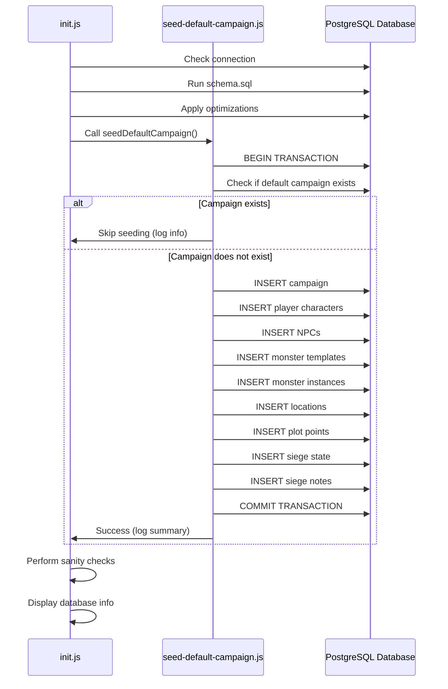

# Design Document: Default Campaign Seeding

## Overview

The default campaign seeding feature automatically populates the database with a starter campaign when no campaigns exist. This provides new users with a working example of the Siege of Neverwinter application, demonstrating all major features including player characters, NPCs, monsters, locations, plot points, and siege mechanics.

The seeding process integrates with the existing database initialization workflow, executing after schema creation but before the application starts serving requests. It operates transactionally to ensure data consistency and is idempotent to prevent duplicate data creation.

### Key Design Decisions

1. **Integration Point**: Seeding executes within `database/init.js` after schema creation and optimization
2. **Transaction Scope**: All seeding operations execute within a single database transaction
3. **Idempotency Strategy**: Check for campaign existence by name before seeding
4. **Error Handling**: Critical failures (campaign creation) trigger rollback; non-critical failures (individual entities) are logged but don't halt the process
5. **Data Realism**: Sample data reflects actual D&D 5e mechanics and the Siege of Neverwinter setting

## Architecture

### Component Structure

```
database/
├── init.js              (modified: adds seeding call)
├── seed-default-campaign.js  (new: seeding logic)
├── db.js                (existing: database connection)
└── schema.sql           (existing: database schema)
```

### Execution Flow



### Error Handling Strategy

The seeding process distinguishes between critical and non-critical failures:

**Critical Failures** (trigger rollback):
- Campaign creation failure
- Database connection loss
- Transaction begin/commit failure

**Non-Critical Failures** (logged but continue):
- Individual PC creation failure
- Individual NPC creation failure
- Individual monster creation failure
- Individual location creation failure
- Individual plot point creation failure
- Siege note creation failure

This approach ensures that if the campaign is created, we attempt to populate as much data as possible, even if some entities fail.

## Components and Interfaces

### 1. Seeding Module (`seed-default-campaign.js`)

Primary module containing all seeding logic.

#### Main Function

```javascript
async function seedDefaultCampaign(pool)
```

**Parameters:**
- `pool`: PostgreSQL connection pool from `db.js`

**Returns:**
- `Promise<boolean>`: `true` if seeding completed (or was skipped), `false` if critical failure occurred

**Behavior:**
- Checks if default campaign exists
- If exists, logs info and returns `true`
- If not exists, executes seeding transaction
- Returns `true` on success, `false` on critical failure

#### Helper Functions

```javascript
async function checkCampaignExists(client)
```
- Queries campaigns table for "Siege of Neverwinter - Tutorial Campaign"
- Returns `boolean`

```javascript
async function createCampaign(client)
```
- Inserts campaign record
- Returns campaign ID
- Throws on failure (critical)

```javascript
async function seedPlayerCharacters(client, campaignId)
```
- Creates 3-4 PC combatants with D&D 5e stats
- Logs individual failures but continues
- Returns count of successfully created PCs

```javascript
async function seedNPCs(client, campaignId)
```
- Creates 2-3 NPC combatants
- Logs individual failures but continues
- Returns count of successfully created NPCs

```javascript
async function seedMonsterTemplates(client, campaignId)
```
- Creates 4-6 monster templates with complete stat blocks
- Includes varying CR levels
- Returns array of created monster IDs

```javascript
async function seedMonsterInstances(client, campaignId, monsterIds)
```
- Creates 2-3 monster instances from templates
- Creates corresponding combatant entries
- Links instances to templates
- Returns count of successfully created instances

```javascript
async function seedLocations(client, campaignId)
```
- Creates 4-6 locations with different statuses
- Assigns map coordinates
- Returns array of created location IDs

```javascript
async function seedPlotPoints(client, locationIds)
```
- Creates 3-5 plot points linked to locations
- Includes different statuses (active, completed)
- Returns count of successfully created plot points

```javascript
async function seedSiegeState(client, campaignId)
```
- Creates siege state with initial values
- Sets wall integrity, morale, supplies
- Adds custom metrics
- Returns siege state ID

```javascript
async function seedSiegeNotes(client, siegeStateId)
```
- Creates 3-5 siege notes
- Chronologically ordered
- Returns count of successfully created notes

### 2. Integration with `init.js`

Modify the existing `initializeDatabase()` function to call seeding after optimizations:

```javascript
// After applyOptimizations() and before performSanityChecks()
const seeded = await seedDefaultCampaign(pool);
if (!seeded) {
  logWarning('Default campaign seeding failed, but continuing...');
}
```

### 3. Logging Interface

All seeding functions use the existing logging utilities from `init.js`:

- `logInfo()`: General information messages
- `logSuccess()`: Successful operations
- `logWarning()`: Non-critical failures
- `logError()`: Critical failures

## Data Models

### Campaign Data

```javascript
{
  name: "Siege of Neverwinter - Tutorial Campaign",
  created_at: <timestamp>,
  updated_at: <timestamp>
}
```

### Player Character Data

Example PC structure:

```javascript
{
  campaign_id: <campaign_id>,
  name: "Elara Moonwhisper",
  type: "PC",
  character_class: "Cleric",
  level: 5,
  initiative: 0,
  ac: 18,
  current_hp: 38,
  max_hp: 38,
  save_strength: 0,
  save_dexterity: 2,
  save_constitution: 1,
  save_intelligence: 0,
  save_wisdom: 5,
  save_charisma: 3,
  notes: "Life Domain cleric, healer and support"
}
```

### NPC Data

Example NPC structure:

```javascript
{
  campaign_id: <campaign_id>,
  name: "Lord Neverember",
  type: "NPC",
  character_class: "Noble",
  level: null,
  initiative: 0,
  ac: 15,
  current_hp: 27,
  max_hp: 27,
  save_strength: 1,
  save_dexterity: 1,
  save_constitution: 1,
  save_intelligence: 2,
  save_wisdom: 2,
  save_charisma: 3,
  notes: "Lord Protector of Neverwinter, quest giver"
}
```

### Monster Template Data

Example monster structure:

```javascript
{
  campaign_id: <campaign_id>,
  name: "Orc Warrior",
  ac: 13,
  hp_formula: "2d8+6",
  speed: "30 ft.",
  stat_str: 16,
  stat_dex: 12,
  stat_con: 16,
  stat_int: 7,
  stat_wis: 11,
  stat_cha: 10,
  saves: { strength: 5, constitution: 5 },
  skills: { intimidation: 2 },
  resistances: [],
  immunities: [],
  senses: "darkvision 60 ft.",
  languages: "Common, Orc",
  cr: "1/2",
  attacks: [
    {
      name: "Greataxe",
      bonus: 5,
      damage: "1d12+3",
      type: "slashing"
    }
  ],
  abilities: [
    {
      name: "Aggressive",
      description: "As a bonus action, move up to speed toward hostile creature"
    }
  ],
  lore: "Orc warriors from the Many-Arrows tribe besieging Neverwinter"
}
```

### Monster Instance Data

```javascript
// Combatant entry
{
  campaign_id: <campaign_id>,
  name: "Orc Warrior 1",
  type: "Monster",
  initiative: 0,
  ac: 13,
  current_hp: 15,
  max_hp: 15,
  save_strength: 5,
  save_dexterity: 1,
  save_constitution: 5,
  save_intelligence: -2,
  save_wisdom: 0,
  save_charisma: 0
}

// Monster instance link
{
  monster_id: <monster_template_id>,
  combatant_id: <combatant_id>,
  instance_name: "Orc Warrior 1"
}
```

### Location Data

Example location structure:

```javascript
{
  campaign_id: <campaign_id>,
  name: "Hall of Justice",
  status: "controlled",
  description: "Temple district stronghold, currently held by defenders",
  coord_x: 150,
  coord_y: 200,
  coord_width: 80,
  coord_height: 60
}
```

### Plot Point Data

Example plot point structure:

```javascript
{
  location_id: <location_id>,
  name: "Rescue the Clerics",
  description: "Several clerics are trapped in the Hall of Justice basement",
  status: "active",
  coord_x: 170,
  coord_y: 220
}
```

### Siege State Data

```javascript
{
  campaign_id: <campaign_id>,
  wall_integrity: 85,
  defender_morale: 70,
  supplies: 60,
  day_of_siege: 5,
  custom_metrics: {
    civilian_casualties: 120,
    enemy_forces_remaining: 450
  }
}
```

### Siege Note Data

Example siege notes:

```javascript
[
  {
    siege_state_id: <siege_state_id>,
    note_text: "Day 5: Enemy catapults damaged the eastern wall. Wall integrity decreased to 85%.",
    created_at: <timestamp>
  },
  {
    siege_state_id: <siege_state_id>,
    note_text: "Day 5: Supply convoy from Waterdeep intercepted. Supplies critical.",
    created_at: <timestamp>
  }
]
```

